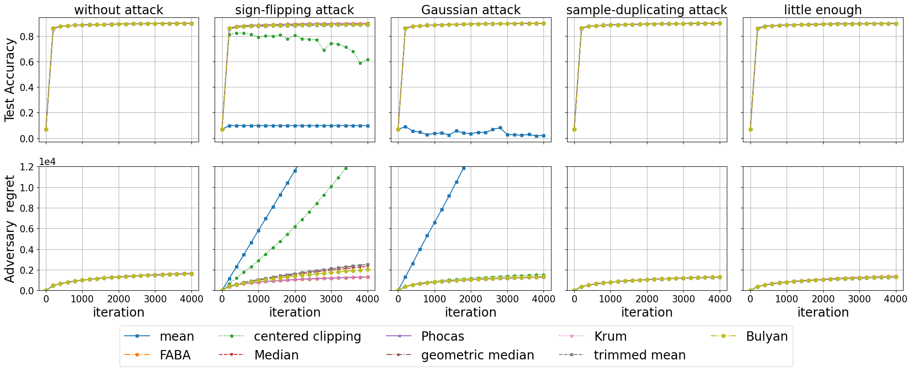

# Tutorial 10: Visualization
RobustFL supports an example metric plot.
In `src.visualization.metric_plotter.py`, you can draw a picture with m*n sub-pictures.

The `metric_names` in follows code decides the `m`, the `extra["graph_types"]` decides the `n`.

```python
def main():
    data_root = "../../"
    metric_names = [metric.TEST_ACCURACY, metric.TEST_LOSS]
    dataset = "Mnist"
    model = "softmax_regression"
    conf = {"graph_type": "CompleteGraph",
            "centralized": "centralized",
            "nodes_cnt": 10,
            "byzantine_cnt": 2,
            "epoch_or_iteration": "iteration",
            "rounds": 10,
            "rounds_iterations": 5000,
            "lr_controller": "ConstantThenDecreasingLr",
            "init_lr": 0.1,
            "momentum_controller": "FollowOne",
            "init_momentum": 0.1,
            "partition_type": "iid",
            "task_name": "",
            "use_momentum": False
            }

    if conf["use_momentum"] is False:
        conf["momentum_controller"] = "ConstantLr"
        conf["init_momentum"] = 0

    extra = dict()
    extra["aggregation_rules"] = ["Mean", "Median", "GeometricMedian", "Krum", "TrimmedMean", "Faba", "Phocas",
                                  "CenteredClipping"]
    extra["aggregation_show_name"] = ["mean", "coordinate-wise median", "geometric median", "Krum", "trimmed mean",
                                      "FABA", "Phocas", "centered clipping"]
    extra["attack_types"] = ["NoAttack", "SignFlipping", "Gaussian", "SampleDuplicating"]
    extra["attack_show_name"] = ["without attack", "sign-flipping attack", "Gaussian attack",
                                 "sample-duplicating attack"]

    metric_plotter(metric_names=metric_names, dataset=dataset, model=model, conf=conf, extra=extra, data_root=data_root)

if __name__ == '__main__':
    main()
```




The metric name you can draw include follows
```python
# performance
TRAIN_ACCURACY = 'train_accuracy'
TRAIN_LOSS = 'train_loss'
TRAIN_BEST_LOSS = "train_best_loss"
TRAIN_STATIC_REGRET = "train_static_regret"
AVG_TRAIN_LOSS = 'avg_train_loss'
AVG_TRAIN_ACCURACY = "avg_train_accuracy"
AVG_TRAIN_STATIC_REGRET = "avg_train_static_regret"


TEST_ACCURACY = 'test_accuracy'
TEST_LOSS = 'test_loss'
TEST_CONSENSUS_ERROR = "test_consensus_error"

TEST_AVG_MODEL_ACCURACY = 'test_avg_model_accuracy'
TEST_AVG_MODEL_LOSS = 'test_avg_model_loss'
```