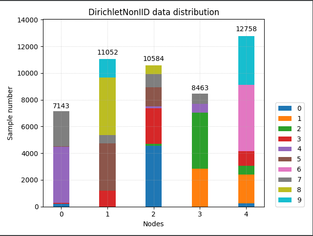

# Tutorial 3: Datasets

In this note, we present how to use the out-of-the-box datasets to simulate different federated learning (FL) scenarios.
Besides, we introduce how to use the customized dataset in RobustFL.

We currently provide four datasets: `MNIST`, `CIFAR-10`, `CIFAR-100` and `Synthetic`. 

## Out-of-the-box Datasets

The simulation of different FL scenarios is configured in the configurations. You can refer to the other [tutorial](config.md) to learn more about how to modify configs. In this note, we focus on how to config the datasets with different simulations.

The following are dataset configurations.

```yaml
# Provide dataset and federated learning simulation related configuration.
data:
  # The name of the dataset, support: Mnist, Cifar10,  Cifar100 and Synthetic
  dataset: "Mnist"
  # The type of statistical simulation, options: iid, successive, empty, share, noniid_class,
  # noniid_class_unbalance, noniid_dir.  (str)
  #    `iid` means independent and identically distributed data.
  #    `successive` means continuous equal scaling of the data.
  #    `empty` means empty dataset for each node.
  #    `share`means each node has full dataset.
  #    `noniid_class` means non-independent and identically distributed data, means partitioning the dataset
  #    by label classes,  for classified datasets.
  #    `noniid_class_unbalance` means non-independent and identically distributed data, means partitioning the dataset
  #    by label classes but unbalanced, each node may have big different size of dataset, for classified datasets.
  #    `noniid_dir` means using Dirichlet process to simulate non-iid data, for classified datasets.
  partition_type: "iid"
  #  (str): Similar to  train_partition_type, default `share`, other partition type can also be set
  test_partition_type: "share"
  #  (int): The number of classes in each node. Only applicable when the partition_type is `noniid_class` and `noniid_class_unbalance`.
  class_per_node: 4
  # (int): The minimal number of samples in each node. It is applicable for `noniid_dir` partition of classified dataset.
  min_size: 10
  #  (float): The unbalanced parameter of samples in each node. Default 0.1. It is applicable for `noniid_dir`
  #           partition of classified dataset.
  alpha: 0.1
  #  (str): The name of iter generator, including random, order, order_circle, full, byrd_saga, customized.
  generator: "random"
  #  (int): Data batch needed for one computation during the training process.
  train_batch_size: 32
  #  (float): (0, 1], test dataset of the local node of the scale used for the test.
  test_rate: 1
```

RobustFL automatically downloads a dataset if it is not exist in the root directory.

Next, we introduce the simulation and configuration for datasets.

#### IID Simulation

In IID simulation, the training images of the datasets are randomly partitioned into `node_cnt` srcs.

#### Non-IID Simulation
We can simulate non-IID datasets by Dirichlet process (`dir`) or by label class (`class`).
##### non-iid-class
`data_balance`: Unbalance mean each node may have the difference size dataset, balance means each node has the approximately same size dataset.

`class_per_node`: class number of per node
##### non-iid-dirichlet
`alpha` controls the level of heterogeneity for `dir` simulation.

`min_size` determines the min size data in each node.

## Plot dataset distribution
In `src.datas.partition.partition_classification.py` and `src.datas.partition.partition_continuous.py`, we support follow two functions to print and draw data distribution. 
```python
    def print_data_distribution(self):
        """
        Return the distribution of data categories for each node through cumulative bar charts.
        """

    def draw_data_distribution(self):
        """
        Draw data distributions for all nodes,
        showing the distribution of data categories for each node through cumulative bar charts.
        """
```

You can add follow codes in function `construct_partition_datasets` in `src.datas.federated_dataset.py` to print and draw partition.
```python
def construct_partition_datasets(self,...)
    train_partition.print_data_distribution()
    train_partition.draw_data_distribution()
```
The effect is shown below

## Customize Datasets

RobustFL also supports integrating with customized dataset to simulate federated learning.

You can use the following to integrate customized dataset: [StackedTorchDataPackage](../src/datas/make_data/trans_torch).

The following is an example.

```python
import src
import os
from torchvision import transforms
from torchvision.datasets import EXAMPLE

from src.datas.make_data import FEATURE_TYPE
from src.datas.make_data.trans_torch import StackedTorchDataPackage

from functools import partial
from importlib import import_module
import random
import torch

from src.datas.partition import partition_continuous, partition_classification
from src.library.logger import create_logger

logger = create_logger()
SYNTHETIC = "Synthetic"

def get_example()
  transform = transforms.Compose([
        transforms.ToTensor(),        transforms.ConvertImageDtype(dtype=FEATURE_TYPE),
        transforms.Normalize(mean=[0.5], std=[0.5])
    ])
  root = 'data/raw'
  torch_train_dataset = EXAMPLE(root=root, train=True,
                                transform=transform, download=True)
  torch_test_dataset = EXAMPLE(root=root, train=False,
                               transform=transform, download=True)

  return torch_train_dataset, torch_test_dataset

class MakeEXAMPLE(StackedTorchDataPackage):
    def __init__(self):
        super().__init__('example', get_example)

def random_generator(dataset, batch_size=1):
    lens = len(dataset)
    while True:
        beg = random.randint(0, lens - 1)
        if beg + batch_size <= lens:
            yield dataset[beg:beg + batch_size]
        else:
            features, targets = zip(dataset[beg:beg + batch_size],
                                    dataset[0:(beg + batch_size) % lens])
            yield torch.cat(features), torch.cat(targets)


def order_circle_generator(dataset, batch_size=1, *args, **kwargs):
    """In order to generate the data, ends when data traversal is complete. """
    lens = len(dataset)
    beg = 0
    while beg < lens-1:
        end = min(beg + batch_size, lens)
        yield dataset[beg:end]
        if end == lens:
            beg = 0
        else:
            beg += batch_size


def order_generator(dataset, batch_size=1):
    lens = len(dataset)
    beg = 0
    while beg < lens-1:
        end = min(beg + batch_size, lens)
        yield dataset[beg:end]


def full_generator(dataset, batch_size=1):
    while True:
        yield dataset[:]

def construct_partition_datasets(
        dataset_name,
        num_of_par_nodes,
        partition_type,
        test_partition_type,
        class_per_node,
        min_size,
        alpha):
    data = MakeEXAMPLE()
    extra_info = {"num_classes": data.num_classes, "feature_dimension": data.feature_dimension,
                  "feature_size": data.feature_size}

    # load partition
    partition_type_dict_class = {"iid": "IIDPartition", "successive": "SuccessivePartition",
                                 "noniid_class": "NonIIDSeparation", "noniid_class_unbalance": "NonIIDSeparation",
                                 "noniid_dir": "DirichletNonIID",
                                 "share": "SharedData", "empty": "EmptyPartition"
                                 }
    partition_type_dict_continuous = {"iid": "IIDPartition", "successive": "SuccessivePartition",
                                      "noniid_class": "SuccessivePartition",
                                      "noniid_class_unbalance": "SuccessivePartition",
                                      "noniid_dir": "SuccessivePartition",
                                      "share": "SharedData", "empty": "EmptyPartition"
                                      }

    if dataset_name == SYNTHETIC and data.num_classes == 1:
        partition_train_load = getattr(partition_continuous, partition_type_dict_continuous[partition_type])
        partition_test_load = getattr(partition_continuous, partition_type_dict_continuous[test_partition_type])
    else:
        partition_train_load = getattr(partition_classification, partition_type_dict_class[partition_type])
        partition_test_load = getattr(partition_classification, partition_type_dict_class[test_partition_type])

    data_balance = False if partition_type == "noniid_class_unbalance" else True
    train_partition = partition_train_load(dataset=data.train_set, node_cnt=num_of_par_nodes,
                                           class_per_node=class_per_node, data_balance=data_balance,
                                           alpha=alpha, min_size=min_size)
    # train_partition.print_data_distribution()
    for x in train_partition:
        random.shuffle(x)
    data_balance = False if test_partition_type == "noniid_class_unbalance" else True
    test_partition = partition_test_load(dataset=data.test_set, node_cnt=num_of_par_nodes,
                                         class_per_node=class_per_node, data_balance=data_balance, alpha=alpha,
                                         min_size=min_size)
    # TODO: There will be a lot of duplicate data under full information, and each node has full datas.
    for x in test_partition:
        random.shuffle(x)
    train_par_set = train_partition.get_subsets(data.train_set)
    test_par_set = test_partition.get_subsets(data.test_set)
    return train_par_set, test_par_set, extra_info


def construct_federated_datasets(dataset_name,
                                 num_of_par_nodes,
                                 partition_type,
                                 test_partition_type,
                                 class_per_node,
                                 min_size,
                                 alpha,
                                 generator,
                                 train_batch_size,
                                 test_rate)

    train_par_set, test_par_set, extra_info = construct_partition_datasets(dataset_name=dataset_name,
                                                                           num_of_par_nodes=num_of_par_nodes,
                                                                           partition_type=partition_type,
                                                                           test_partition_type=test_partition_type,
                                                                           class_per_node=class_per_node,
                                                                           min_size=min_size,
                                                                           alpha=alpha)

    extra_info["train_data_size_each"] = [len(x) for x in train_par_set]
    extra_info["test_data_size_each"] = [len(x) for x in test_par_set]
    # load partition dataset iter
    data_generator = eval("{}_generator".format(generator))
    get_train_iter = partial(data_generator,
                             batch_size=train_batch_size)
    train_data_iter = [get_train_iter(dataset=train_par_set[node]) for node in range(num_of_par_nodes)]

    test_generator = full_generator if test_rate == 1 else order_circle_generator
    # test_generator = full_generator if test_rate == 1 else random_generator
    get_test_iter = partial(test_generator)
    test_data_iter = [get_test_iter(dataset=test_par_set[node], batch_size=int(len(test_par_set[node]) * test_rate))
                      for node in range(num_of_par_nodes)]

    return train_data_iter, test_data_iter, extra_info


if __name__ == '__main__':
    config = {"ataset_name": "axample",
              "num_of_par_nodes":10,
              "partition_type":iid,
              "class_per_node":10,
              "min_size":10,
              "alpha":0.1,
              "generator":"random",
              "train_batch_size":32,
              "test_rate":1,
              }
    train_data_iter, test_data_iter, extra_info 
    = construct_federated_datasets(dataset_name=config["dataset_name"],
                        num_of_par_nodes=config["num_of_par_nodes"],
                        partition_type=config["partition_type"],
                        test_partition_type=config["test_partition_type"],
                        class_per_node=config["class_per_node"],
                        min_size=config["min_size"],
                        alpha=config["alpha"],
                        generator=config["generator"],
                       train_batch_size=config["train_batch_size"],
                        test_rate=config["test_rate"])
    src.register_dataset(train_data_iter, test_data_iter)
    src.init(config)
    src.run()
```

