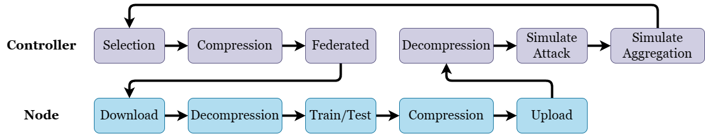

# Tutorial 5: Customize Controller and Node

RobustFL abstracts the robust federated learning (FL) training flow in the controller and the node into granular stages, as shown in the image below.



**The controller** is responsible for scheduling the nodes. 
- Firstly, it selects some nodes who will participate next training. 
- Secondly it compresses (<font color= #DCDCDC>#TODO</font>) the current model of the nodes. 
- Thirdly, it schedules the node instances to update model, train and test. 
- Fourthly, after nodes uploads the messages (include node new models), it decompresses (<font color= #DCDCDC>#TODO</font>) the models. 
- Fifthly, it simulates the Byzantine node attack to change the uploaded messages, 
- Sixty, it simulates the server or nodes to aggregates the uploaded messages.

**The node** instance is responsible for local training and testing.
- Firstly, it downloads the controller returned compressed model and update the local compressed model.
- Secondly, it decompresses (<font color= #DCDCDC>#TODO</font>) the model to local model.
- Thirdly, it trains in local, and tests at intervals.
- Fourthly, it compresses (<font color= #DCDCDC>#TODO</font>) its trained model.
- Fifthly, it uploads its model, gradient, and training and testing performance to the controller.

**For the centralized distributed learning**, the controller stand for the central server, the one node instance stand for one worker. To make it easier and in order to achieve an omnipotent attack, we simulated the Byzantine node attack sent message in controller.

**For the decentralized distributed learning**, the controller stand for nothing, only a code organizer. To make it easier, we simulated the Byzantine node attack sent message and node aggregates messages from neighbors node in controller.

You have the flexibility to customize any stage of the training flow while reusing the rest by implementing a customized controller/node.  

## Customize Controller

RobustFL implements random node selection and [Robust aggregation rule](../../src/aggregations/base_aggregation.py) as the aggregation strategy and [Byzantine attack](../../src/attacks/base_attack.py) as the attack strategy. 
You can customize the controller implementation by inheriting [BaseController](../../src/train/controller/base_controller.py) and override specific functions.

Below is an example of a customized controller. 
```python
import src
from src.train.controller import BaseController

class CustomizedController(BaseController):
    def __init__(self, conf, test_data=None, val_data=None):
        super(CustomizedController, self).__init__(conf, test_data, val_data, **kwargs)
        pass  # more initialization of attributes.

    def aggregate_and_attack(self):
        # If you want the nodes do not communicate and aggregation,
        # then do nothing. 
        # Note: we need the sent message is model not the gradient.       
        pass

# Register customized controller in this main.py.
src.register_controller(CustomizedController)
# Initialize federated learning with default configurations.
src.init()
# Execute federated learning training.
src.run()
```

Here we list down more useful functions to override to implement a customized controller.  

```python
import src
from src.train.controller import BaseController

class CustomizedController(BaseController):
    def __init__(self, conf, **kwargs):
        super(CustomizedController, self).__init__(conf, **kwargs)
        pass  # more initialization of attributes.
    def start(self, model, nodes, graph_, agg_class, attack_class):
        pass # implement customized controller control flow.

    def selection(self, nodes, nodes_per_round):
        pass  # implement customized node selection algorithm.
    
    def compression(self):
        pass  # implement customized compression algorithm.
    
    def pre_train(self):
        pass  # inject operations before distribution to train.
    
    def post_train(self):
        pass  # inject operations after aggregation.
    
    def pre_test(self):
        pass  # inject operations before distribution to test. 
    
    def post_test(self):
        pass  # inject operations after aggregating testing results.
    
    def decompression(self, model):
        pass  # implement customized decompression algorithm.
    
    def aggregate_and_attack(self):
        pass  # implement customized aggregation and attack algorithm.
```

Below are some attributes that you may need in implementing the customized controller.

`self.conf`: Configurations of RobustFL.

`self._model`: The global model in controller, updated after aggregation.

`self._current_round`: The current training round.

`self._nodes`: All available nodes.

`self.selected_nodes`: The selected nodes.

`self._test_accuracies`: The all nodes cumulative test accuracies, which will be recorded.

You may refer to the [BaseController](../../src/train/controller/base_controller.py) for more functions and class attributes.

## Customize Node

Each node of RobustFL conducts training and testing. 
The implementation of training and testing is similar to normal PyTorch implementation.
We implement training with Adam/SGD optimizer using CrossEntropy loss for Classification tasks and MSELoss for regression task. 
You can customize node implementation of training and testing by inheriting [BaseNode](../../src/train/nodes/base_node.py) and overriding specific functions. 

Below is an example of a customized node. 

```python
import time
import src
from torch import nn
import torch.optim as optim
from src.train.nodes.base_node import BaseNode

# Inherit BaseNode to implement customized node operations.
class CustomizedNode(BaseNode):
    def __init__(self, cid, conf, train_data, test_data, device, **kwargs):
        super(CustomizedNode, self).__init__(cid, conf, train_data, test_data, device, **kwargs)
        # Initialize a classifier for each node.
        self.classifier = nn.Sequential(*[nn.Linear(512, 100)])

    def train(self, conf, device):
        start_time = time.time()
        self.model.classifier.classifier = self.classifier.to(device)
        loss_fn, optimizer = self.pretrain_setup(conf, device)
        self.train_loss = []
        for i in range(conf.local_epoch):
            batch_loss = []
            for batched_x, batched_y in self.train_loader:
                x, y = batched_x.to(device), batched_y.to(device)
                optimizer.zero_grad()
                out = self.model(x)
                loss = loss_fn(out, y)
                loss.backward()
                optimizer.step()
                batch_loss.append(loss.item())
            current_epoch_loss = sum(batch_loss) / len(batch_loss)
            self.train_loss.append(float(current_epoch_loss))
        self.train_time = time.time() - start_time
        # Keep the classifier in nodes and upload only the backbone of model. 
        self.classifier = self.model.classifier.classifier
        self.model.classifier.classifier = nn.Sequential()        

# Register customized node in this main.py.
src.register_node(CustomizedNode)
# Initialize federated learning with default configurations.
src.init()
# Execute federated learning training.
src.run()
```

Here we list down more useful functions to override to implement a customized node.  

```python
import src
from src.train.node import BaseNode

# Inherit BaseNode to implement customized node operations.
class CustomizedNode(BaseNode):
    def __init__(self, cid, conf, train_data, test_data, device, **kwargs):
        super(CustomizedNode, self).__init__(cid, conf, train_data, test_data, device, **kwargs)
        pass  # more initialization of attributes.

    def decompression(self):
        pass  # implement decompression method.

    def pre_train(self):
        pass  # inject operations before training. 

    def train(self, conf, device):
        pass  # implement customized training method.
    
    def train_iteration(self, conf, device):
        pass  # implement customized training method.

    def train_epoch(self, conf, device):
        pass  # implement customized training method.
    
    def post_train(self):
        pass  # inject operations after training.
    
    def load_loss_fn(self, conf):
        pass  # load a customized loss function.
        return loss

    def load_optimizer(self, conf):
        pass  # load a customized optimizer
        return optimizer

    def pre_test(self):
        pass  # inject operations before testing. 

    def test(self, conf, device):
        pass  # implement customized testing.
    
    def post_test(self):
        pass  # inject operations after testing.

    def compression(self):
        pass  # implement customized compression method.

    def upload(self):
        pass  # implement customized upload method.

    def post_upload(self):
        pass  # implement customized post upload method.
```

Below are some attributes that you may need in implementing the customized node.

`self.conf`: Configurations of node, under key "node" of config dictionary.

`self.compressed_model`: The model downloaded from the controller.

`self.model`: The model used for training.

`self.cid`: The node id.

`self.device`: The device for training. 

`self.train_loader`: The training data loader of the node.

`self.test_loader`: The testing data loader of the node.

`self.lr_controller`: The learning rate controller of the node.

You may refer to the [BaseNode](../../src/train/nodes/base_node.py) for more functions and class attributes.
