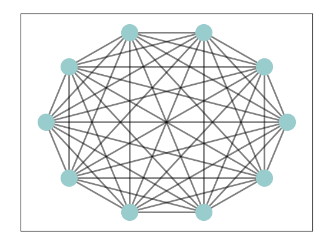

# Tutorial 8: Graphs

RobustFL supports numerous graphs and allows you to customize the graph.

## Out-of-the-box Graphs

To use these graphs, you can set configurations `graph_type: <graph_name>`. 

We currently provide `CompleteGraph`, `ErdosRenyi`, `TwoCastle`, `RingCastle` and `OctopusGraph`

## Plot Graph 
We support `show` function in `src.library.graph.Graph`. When you initialize a Graph instance, you can use follows to draw the graph.
```python
graph_ = graph_class(...)
graph_.show()
```


## Customized Graphs

RobustFL allows training with a wide range of graphs by providing the flexibility to customize graph. 
You can customize and register graph in one way: register as a class. Either way, the basic is to **inherit and implement the `src.library.graph.Graph`**. 

### Register as a Class

In the example below, we implement and conduct RobustFL training with a `CustomizedGraph`. 

It is applicable when the graph does not require extra arguments to initialize.

```python
import random

import matplotlib.pyplot as plt
import networkx as nx
from src.library.graph import Graph

# Define a customized graph class.
class CustomizedGraph(Graph):
    def __init__(self, node_size, byzantine_size, centralized, *args, **kwargs):
        assert node_size > byzantine_size
        graph = nx.complete_graph(node_size)

        honest_nodes = list(range(node_size - byzantine_size))
        byzantine_nodes = list(range(node_size - byzantine_size, node_size))
        name = f'Complete_n={node_size}_b={byzantine_size}'
        super(CompleteGraph, self).__init__(name=name, nx_graph=graph, centralized=centralized,
                                            honest_nodes=honest_nodes,
                                            byzantine_nodes=byzantine_nodes)

# Register the customized graph class.
src.register_graph(CustomizedGraph)
# Initialize RobustFL.
src.init()
# Execute FL training.
src.run()
```